# XHS Images · Minimal

`minimal` 风格的参考图。首张来自 [baoyu-skills](https://github.com/JimLiu/baoyu-skills) 官方示例。

[← 返回场景索引](../README.md) | [← 返回总索引](../../README.md)

## 画廊

<!-- 由 scripts/gen_scenario_readmes.py 自动生成,勿手编 -->

|   |   |   |
|:---:|:---:|:---:|
| [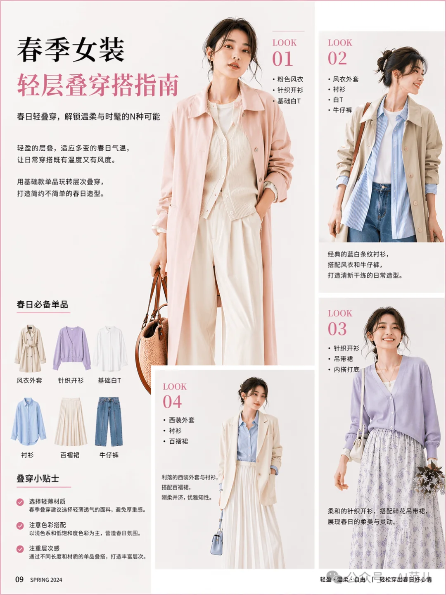](./xhs-minimal-spring-layering-guide.webp) | [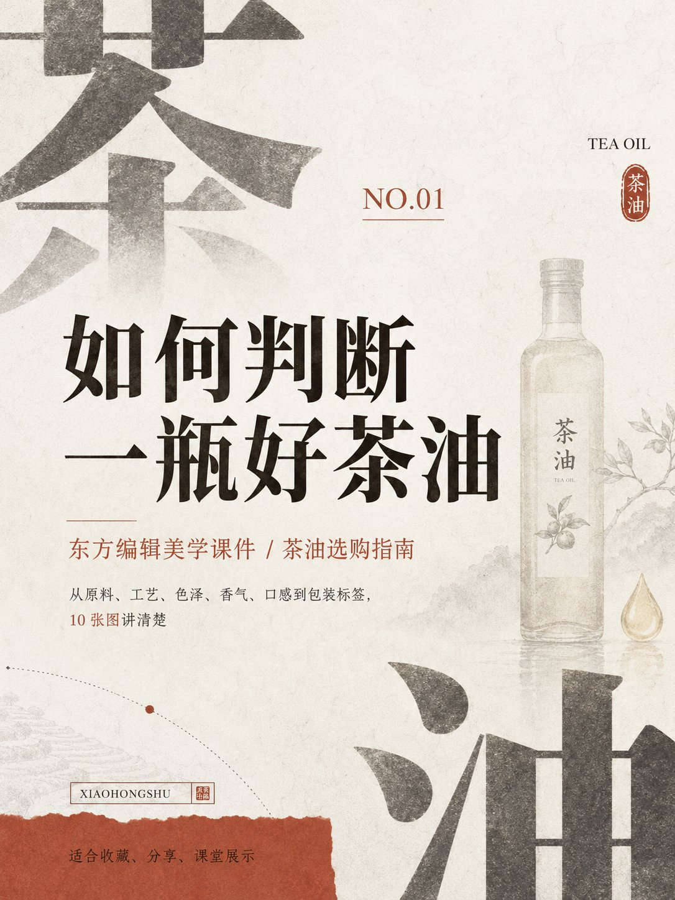](./xhs-minimal-tea-oil-guide-0.jpeg) | [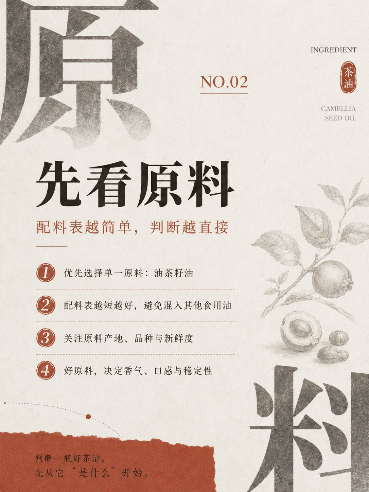](./xhs-minimal-tea-oil-guide-1.jpeg) |
| spring-layering-guide | tea-oil-guide-0 📝 | tea-oil-guide-1 📝 |
| [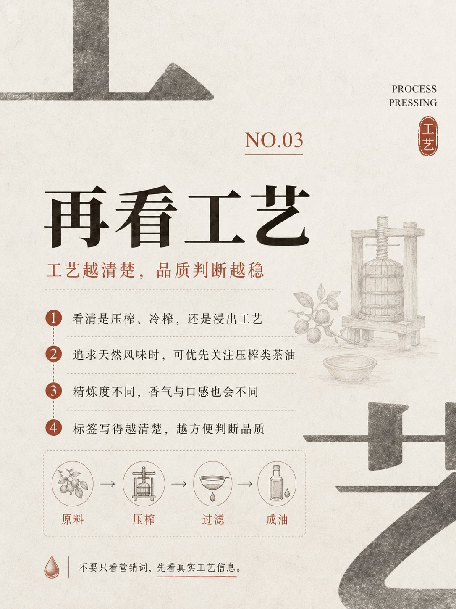](./xhs-minimal-tea-oil-guide-2.jpeg) | [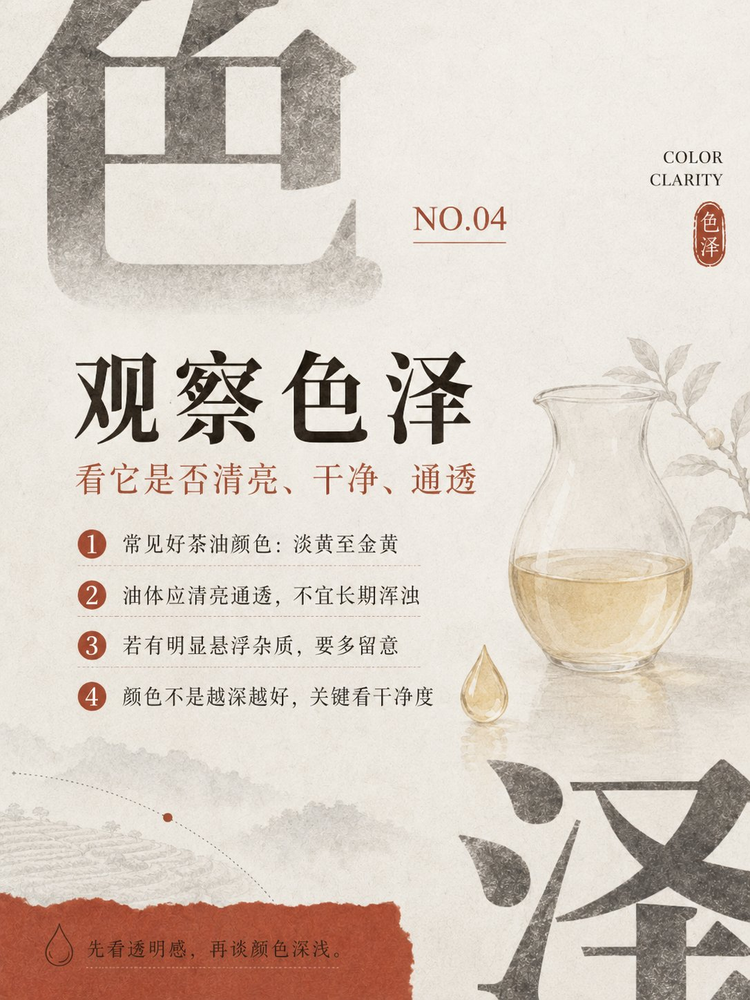](./xhs-minimal-tea-oil-guide-3.jpeg) | [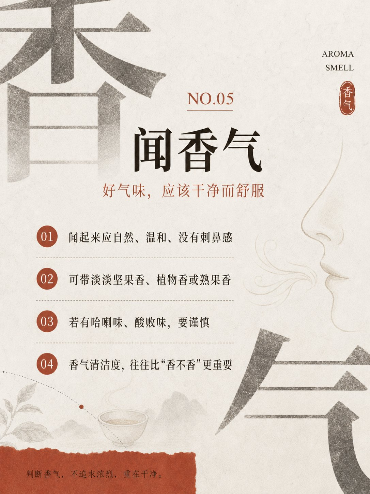](./xhs-minimal-tea-oil-guide-4.jpeg) |
| tea-oil-guide-2 📝 | tea-oil-guide-3 📝 | tea-oil-guide-4 📝 |
| [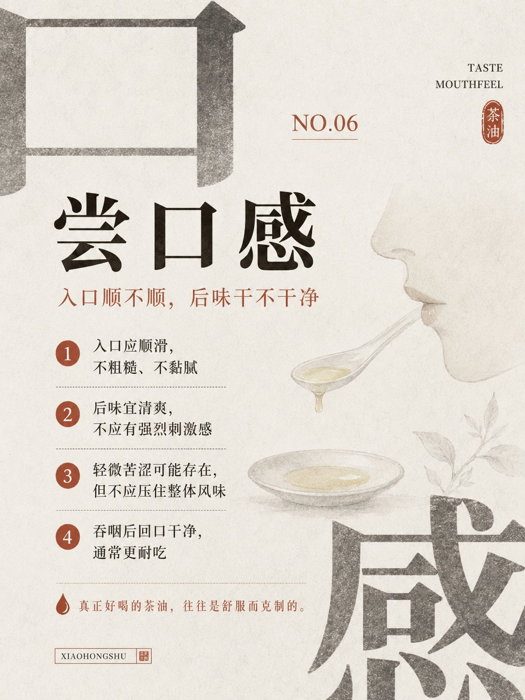](./xhs-minimal-tea-oil-guide-5.jpeg) | [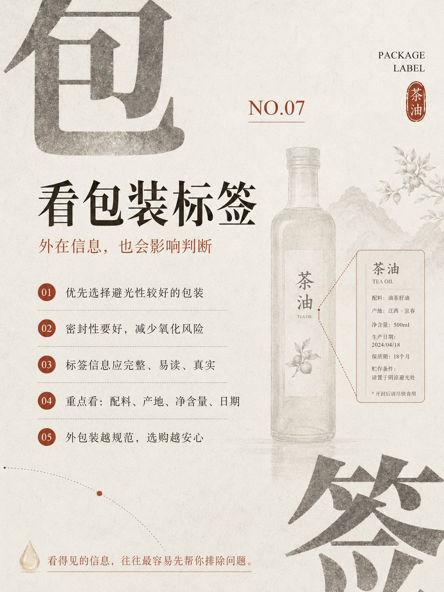](./xhs-minimal-tea-oil-guide-6.jpeg) | [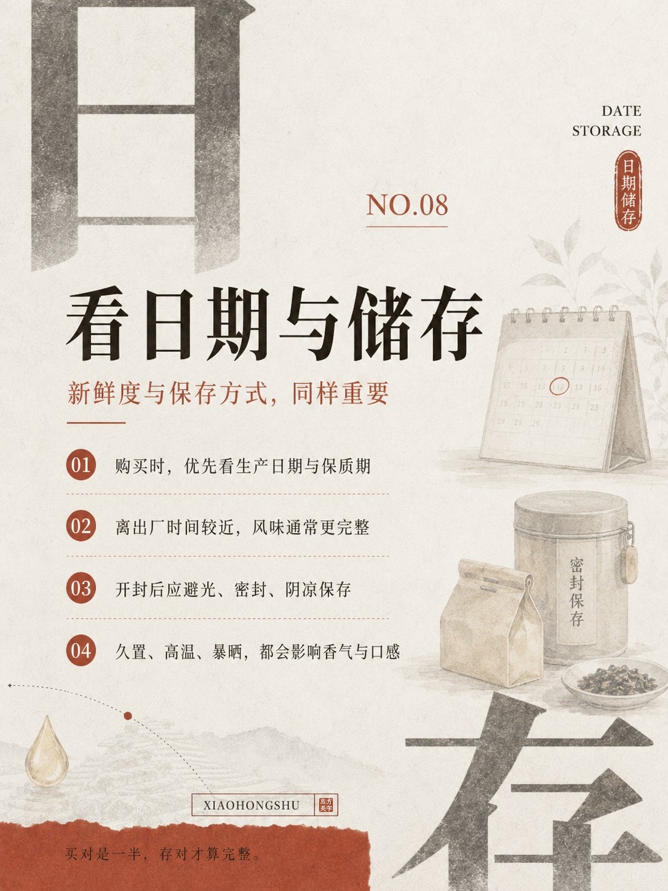](./xhs-minimal-tea-oil-guide-7.jpeg) |
| tea-oil-guide-5 📝 | tea-oil-guide-6 📝 | tea-oil-guide-7 📝 |
| [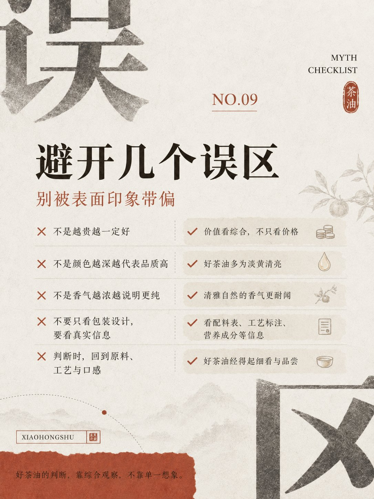](./xhs-minimal-tea-oil-guide-8.jpeg) | [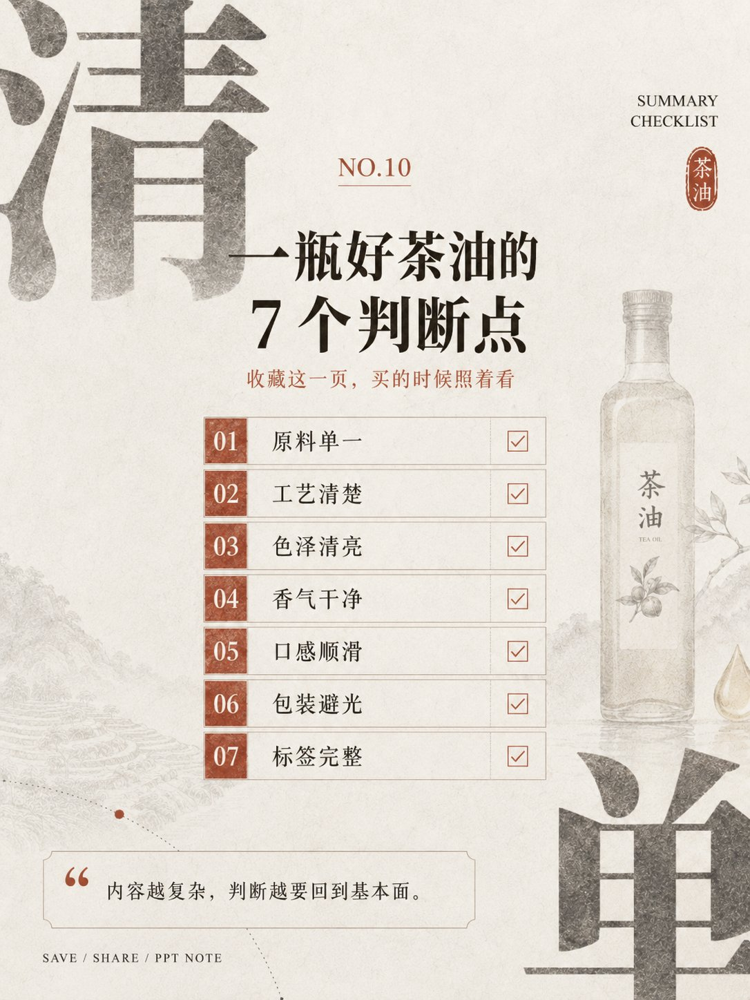](./xhs-minimal-tea-oil-guide-9.jpeg) | [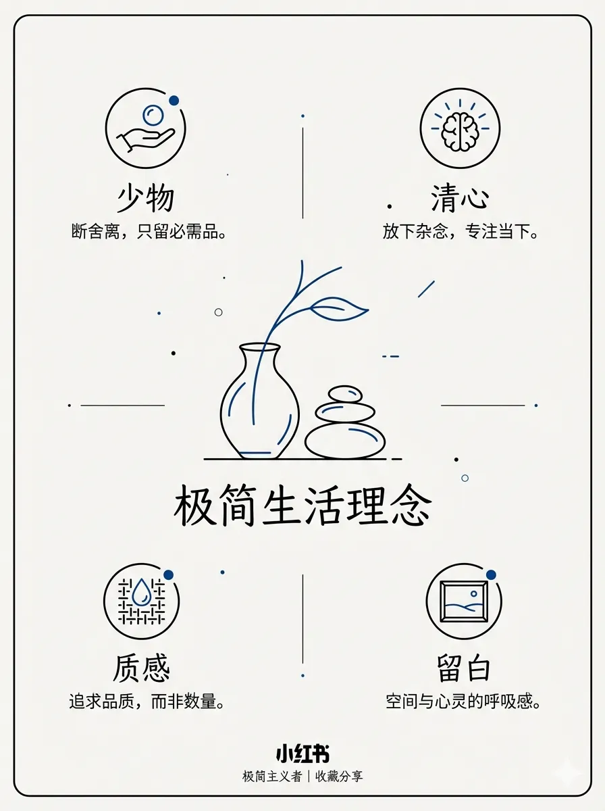](./xhs-minimal-baoyu.webp) |
| tea-oil-guide-8 📝 | tea-oil-guide-9 📝 | baoyu |

## 元数据

| 文件 | 主体 | 标签 | 来源 | Prompt |
|---|---|---|---|---|
| [xhs-minimal-spring-layering-guide](./xhs-minimal-spring-layering-guide.webp) | 春季女装轻层叠穿搭指南:Look 示范 + 单品清单 + 生活贴士 | `fashion` `spring` `xhs` `guide` `minimal` `gpt-image-2` | — | — |
| [xhs-minimal-tea-oil-guide-0](./xhs-minimal-tea-oil-guide-0.jpeg) | 茶油选购指南 NO.01 封面:大字「茶」裁切 + 茶油瓶水墨主图 | `xhs` `oriental-editorial` `tea-oil` `ppt` `series` `gpt-image-2` | — | [prompt: 东方编辑美学课件…](./xhs-minimal-tea-oil-guide.md) |
| [xhs-minimal-tea-oil-guide-1](./xhs-minimal-tea-oil-guide-1.jpeg) | NO.02:看原料(茶籽来源 / 品种 / 产地) | `xhs` `oriental-editorial` `tea-oil` `ppt` `series` `gpt-image-2` | — | [prompt: 东方编辑美学课件…](./xhs-minimal-tea-oil-guide.md) |
| [xhs-minimal-tea-oil-guide-2](./xhs-minimal-tea-oil-guide-2.jpeg) | NO.03:看工艺(冷榨 vs 热榨) | `xhs` `oriental-editorial` `tea-oil` `ppt` `series` `gpt-image-2` | — | [prompt: 东方编辑美学课件…](./xhs-minimal-tea-oil-guide.md) |
| [xhs-minimal-tea-oil-guide-3](./xhs-minimal-tea-oil-guide-3.jpeg) | NO.04:看色泽 | `xhs` `oriental-editorial` `tea-oil` `ppt` `series` `gpt-image-2` | — | [prompt: 东方编辑美学课件…](./xhs-minimal-tea-oil-guide.md) |
| [xhs-minimal-tea-oil-guide-4](./xhs-minimal-tea-oil-guide-4.jpeg) | NO.05:闻香气 | `xhs` `oriental-editorial` `tea-oil` `ppt` `series` `gpt-image-2` | — | [prompt: 东方编辑美学课件…](./xhs-minimal-tea-oil-guide.md) |
| [xhs-minimal-tea-oil-guide-5](./xhs-minimal-tea-oil-guide-5.jpeg) | NO.06:尝口感(入口顺滑 / 后味清爽 / 4 条要点) | `xhs` `oriental-editorial` `tea-oil` `ppt` `series` `gpt-image-2` | — | [prompt: 东方编辑美学课件…](./xhs-minimal-tea-oil-guide.md) |
| [xhs-minimal-tea-oil-guide-6](./xhs-minimal-tea-oil-guide-6.jpeg) | NO.07:看包装/标签 | `xhs` `oriental-editorial` `tea-oil` `ppt` `series` `gpt-image-2` | — | [prompt: 东方编辑美学课件…](./xhs-minimal-tea-oil-guide.md) |
| [xhs-minimal-tea-oil-guide-7](./xhs-minimal-tea-oil-guide-7.jpeg) | NO.08:踩坑提示 | `xhs` `oriental-editorial` `tea-oil` `ppt` `series` `gpt-image-2` | — | [prompt: 东方编辑美学课件…](./xhs-minimal-tea-oil-guide.md) |
| [xhs-minimal-tea-oil-guide-8](./xhs-minimal-tea-oil-guide-8.jpeg) | NO.09:推荐场景 | `xhs` `oriental-editorial` `tea-oil` `ppt` `series` `gpt-image-2` | — | [prompt: 东方编辑美学课件…](./xhs-minimal-tea-oil-guide.md) |
| [xhs-minimal-tea-oil-guide-9](./xhs-minimal-tea-oil-guide-9.jpeg) | NO.10:总结/收束页 | `xhs` `oriental-editorial` `tea-oil` `ppt` `series` `gpt-image-2` | — | [prompt: 东方编辑美学课件…](./xhs-minimal-tea-oil-guide.md) |
| [xhs-minimal-baoyu](./xhs-minimal-baoyu.webp) | `minimal` 参考示例 | `baoyu-skills` `minimal` | [baoyu-skills](https://github.com/JimLiu/baoyu-skills) | — |

**说明**:来源缺失填 `—`;Prompt 有 sidecar 写带 20 字摘要的链接 `[prompt: <摘要>…](./<trunk>.md)`(trunk = basename 去 `-NN`,多图共享时多行指向同一个 sidecar),无则填 `—`;标签用反引号包裹。
